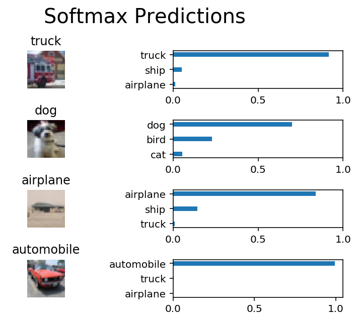

## imageDL
The second project for the [Deep Learning Foundations Nanodegree program](https://www.udacity.com/course/deep-learning-nanodegree-foundation--nd101), designed to introduce the concepts of Convolutional Neural Networks (and Layers!)

All of the fun stuff (in it's submission) format is available in [`image_classification.ipynb`](https://github.com/Vvkmnn/introDL/blob/master/image_classification.ipynb).

### Setup

This project requires Python 3 (Preferably as distributed by [Anaconda](https://www.continuum.io/downloads)) and [Tensorflow](https://www.tensorflow.org/).

### Results

In this project, we implemented the steps necessary to build a simple image-classification network (pictured above), by implementing multiple kinds of **Layers**:
* **Convolutional Pooling Layers**
* **Flattening Layers**
* **Fully Connected Layers**
* **One-Hot Encoded Output Layers**
* **Probabilistic Dropout** 

The **final model** yielded a final **Testing Accuracy of 0.67** using *25 epochs*, a *batch size of 128*, with a *dropout rate of 50%*, which can be considered effecient performance:

